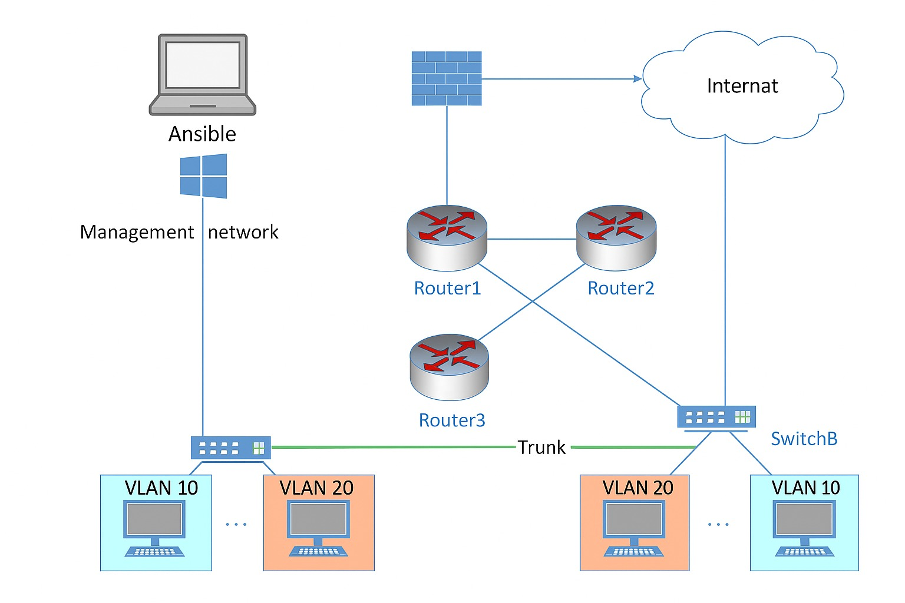

# MN521 - Network Automation

This repository contains our group project work for **MN521: Network Automation** at Melbourne Institute of Technology (MIT).  
We are exploring the role of automation in networking through hands-on labs, weekly progress tracking, and documentation.

---

## 👥 Group Members
- Joel  
- YoungHyun Kim  
- Renz  
- Shashi  
- Meena  

---

## Notes on Ansible Inventory

The inventory files in this repository contain sample credentials (e.g., `ansible_password=cisco123`) and legacy crypto settings.  
Please note:

- These values are **for GNS3 lab and academic assignment purposes only**.  
- They do not represent any production environment or real credentials.  
- In a real-world setting, sensitive data would be stored securely (e.g., Ansible Vault, environment variables, or external secrets management).  

## 📂 Repository Structure

📂 Documents/       # Reports, design docs, and written submissions  
📂 Progress/        # Weekly progress folders  
   ├─ 📁 Week1/     # Introduction to Network Automation  
   ├─ 📁 Week2/  
   ├─ 📁 Week3/  
   ├─ 📁 Week4/  
   ├─ 📁 Week5/  
   ├─ 📁 Week6/  
   ├─ 📁 Week7/  
   ├─ 📁 Week8/  
   ├─ 📁 Week9/  
   ├─ 📁 Week10/  
   ├─ 📁 Week11/  
   └─ 📁 Week12/  
📄 README.md  

- **Documents/** → All formal reports and supporting documentation.  
- **Progress/** → Weekly practicals, configurations, and code samples.  

---

## 🌐 Network Architecture

We will include diagrams to visualize our **network automation architecture** and **lab topology**.  
Please note:  
- These diagrams may evolve as our project progresses.  
- Both physical and virtual network components will be represented.  

*(Example placeholder below – to be replaced with actual diagram)*  

---

## 🚀 Topics Covered

- Networking Fundamentals & Automation Basics  
- Bash & Python for Network Automation  
- APIs: NETCONF, RESTCONF, gNMI  
- Source Control with Git  
- Ansible for Configuration Management  
- Terraform for Infrastructure as Code  
- NetDevOps & CI/CD pipelines  
- Network Automation Architecture  
- Network Security Automation  
- Software Defined Networking (SDN)  
- Network Function Virtualization (NFV)  

---

## 📌 Notes
- This project is academic work under MIT’s **Master of Networking (Cyber Security)** course.  
- All progress is tracked weekly for clarity and continuous improvement.  
- Tools and configurations used: **Ansible, Terraform, Git, GNS3, Python, Bash**.

---

## 🏗️ Lab Network Topology (v2 Update)

> **Note:** This section was added in the **v2 update** of the README to extend beyond the initial repository structure description.  
> Earlier versions (v1) focused mainly on group members, folder structure, and weekly topics.  
> With this update, we now include **network topology design, automation scenarios, and testing metrics**.

### Topology Components
| Component              | Qty | Description |
|------------------------|-----|-------------|
| **Core Router**        | 1   | Backbone of the topology (Cisco IOSv / CSR1000v or Juniper vMX). |
| **Distribution Switch**| 2   | VLAN aggregation, connects Access Switches to Core. |
| **Access Switch**      | 3   | L2 switches for VPCs/servers, VLAN tagging practice. |
| **Firewall**           | 1   | ACL and firewall automation (Juniper vSRX). |
| **VPC / Server Nodes** | 3–4 | App, DB, management servers. |
| **Automation Controller** | 1 | Ubuntu VM with Ansible. |
| **Jump Host**          | 1   | SSH access, external config changes. |

---

### Recommended Images
- **Cisco:** IOSv, IOSvL2, CSR1000v  
- **Juniper:** vSRX, vMX  
👉 *Preferred: Cisco IOSv + Juniper vSRX (multi-vendor setup).*

---

### Automation Tools
- **Ansible** (primary) – Playbooks for config automation (agentless)  
- **Netmiko** (secondary) – Python-based CLI automation, useful for debugging  
- **GNS3** – Virtual lab environment for real router/switch images  
- **Git** – Source control for configs, playbooks, and reports  
- **Prometheus/Grafana** (optional) – Performance dashboards, pre/post automation comparison  

---

### Test Scenarios
1. VLAN automation (manual 10–15m → automated 1–2m)  
2. OSPF/BGP routing automation  
3. Firewall rule automation on vSRX  
4. Failure recovery (manual 30m+ → automated ≤5m)

---

### Metrics
| Task                  | Manual | Automated | Improvement |
|-----------------------|--------|-----------|-------------|
| VLAN/Routing Setup    | 20–30m | 3–5m | Faster |
| Policy Change         | 5m     | 1m   | SLA ↑ |
| Recovery              | 30m+   | ≤5m  | Downtime ↓ |
| CLI Commands Entered  | 100+   | 0–5  | Errors ↓ |

---

## 📜 Changelog

- **v1.0 (Initial)** – Added group members, repository structure, weekly topics list.  
- **v2.0 (Current)** – Added **Lab Network Topology**, **Automation Tools**, **Test Scenarios**, and **Performance Metrics**.  
  Shows progression from simple documentation to full-fledged lab environment planning.

---

